<div align="center">

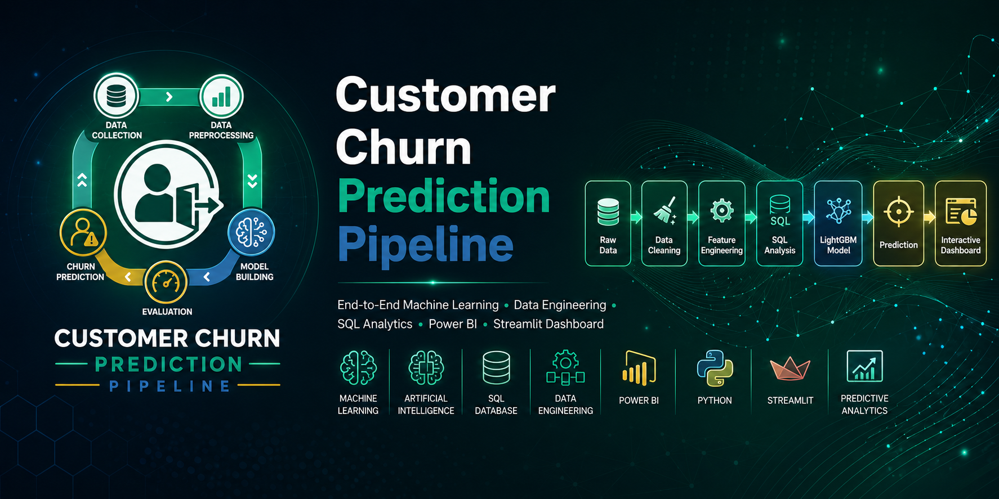

<br/>

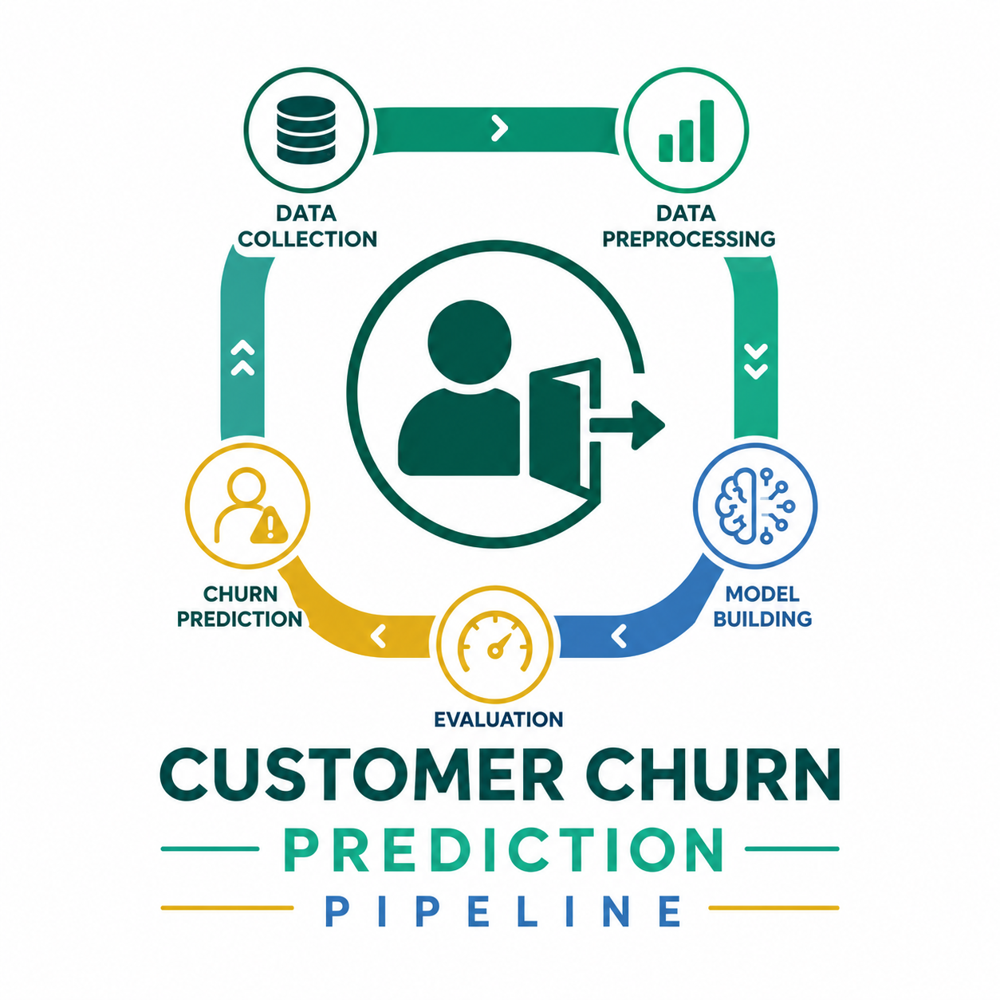

<h1>📊 Customer Churn Prediction Pipeline</h1>

<p>
  <b>An end-to-end Machine Learning system for predicting customer churn at scale</b><br/>
  Built on nearly <b>1,000,000</b> telecom customer records — from raw data to real-time prediction.
</p>

<a href="https://git.io/typing-svg">
  
</a>

<br/><br/>

<!-- Badges -->
<p>
  
  
  
  
</p>
<p>
  
  
  
  
</p>
<p>
  
  
  
  
</p>

<br/>

<a href="https://customer-churn-prediction-pipeline.streamlit.app/">
  
</a>

<br/><br/>

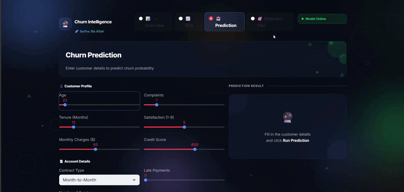

</div>

<br/>

---

## 📑 Table of Contents

- [Project Overview](#-project-overview)
- [Business Problem](#-business-problem)
- [Features](#-features)
- [Dataset Overview](#-dataset-overview)
- [Project Architecture](#-project-architecture)
- [Machine Learning Pipeline](#-machine-learning-pipeline)
- [Project Structure](#-project-structure)
- [Data Engineering](#-data-engineering)
- [Exploratory Data Analysis](#-exploratory-data-analysis)
- [SQL Analysis](#-sql-analysis)
- [Machine Learning](#-machine-learning)
- [Model Comparison](#-model-comparison)
- [Feature Importance](#-feature-importance)
- [ROC Curve](#-roc-curve)
- [Confusion Matrix](#-confusion-matrix)
- [Streamlit Dashboard](#-streamlit-dashboard)
- [Power BI Dashboard](#-power-bi-dashboard)
- [Results](#-results)
- [Technology Stack](#-technology-stack)
- [Installation](#-installation)
- [Usage](#-usage)
- [Future Improvements](#-future-improvements)
- [Author](#-author)
- [License](#-license)

---

## 🧭 Project Overview

**Customer Churn Prediction Pipeline** is a production-grade, end-to-end machine learning system designed to identify telecom customers at risk of churning **before they leave**. The project spans the full data lifecycle — ingestion, cleaning, validation, feature engineering, exploratory analysis, SQL-based reporting, model training, evaluation, and deployment through interactive dashboards.

Built on a dataset of **999,999 customer records** and **32 features**, the pipeline combines rigorous data engineering with a tuned **LightGBM** classifier, surfaced through both a **Streamlit** web application for real-time prediction and a **Power BI** dashboard for executive-level business reporting.

> 💡 This repository is structured to mirror how churn prediction systems are built and deployed in real production environments — not as a one-off notebook, but as a maintainable, modular pipeline.

---

## 💼 Business Problem

Customer churn is one of the most expensive problems in the telecom industry. Acquiring a new customer typically costs **5–7x more** than retaining an existing one, yet most companies react to churn only after it has already happened.

This project addresses three core business questions:

| Question | Why It Matters |
|---|---|
| **Who is going to churn?** | Enables proactive retention campaigns instead of reactive win-back offers |
| **Why are they churning?** | Surfaces the top drivers of churn to inform product & pricing decisions |
| **When should we intervene?** | Prioritizes high-risk, high-value customers for immediate outreach |

By converting raw usage and billing data into a calibrated churn probability score, business teams can target retention budget where it has the highest expected return.

---

## ✨ Features

| | Capability |
|---|---|
| ✔ | Automated **data cleaning** & validation pipeline |
| ✔ | Robust **feature engineering** on raw telecom data |
| ✔ | In-depth **exploratory data analysis (EDA)** |
| ✔ | **SQL Server** analytical queries for business reporting |
| ✔ | **Machine Learning** model training & benchmarking |
| ✔ | Rigorous **model evaluation** (ROC-AUC, Recall, F1, Confusion Matrix) |
| ✔ | Interactive **Streamlit dashboard** with real-time prediction |
| ✔ | Executive **Power BI dashboard** for stakeholder reporting |
| ✔ | **MLflow** experiment tracking for reproducibility |
| ✔ | **Real-time prediction** API/interface for single-customer scoring |

---

## 🗃 Dataset Overview

<div align="center">

| Metric | Value |
|---|---|
| **Total Customers** | 999,999 |
| **Total Features** | 32 |
| **Target Variable** | `Churn` (Binary) |
| **Data Source** | Telecom customer usage, billing & demographic records |

</div>

The dataset captures a wide range of signals including customer demographics, subscription/contract details, billing history, service usage patterns, and support interaction history — all of which feed into the feature engineering stage of the pipeline.

---

## 🏗 Project Architecture

<div align="center">
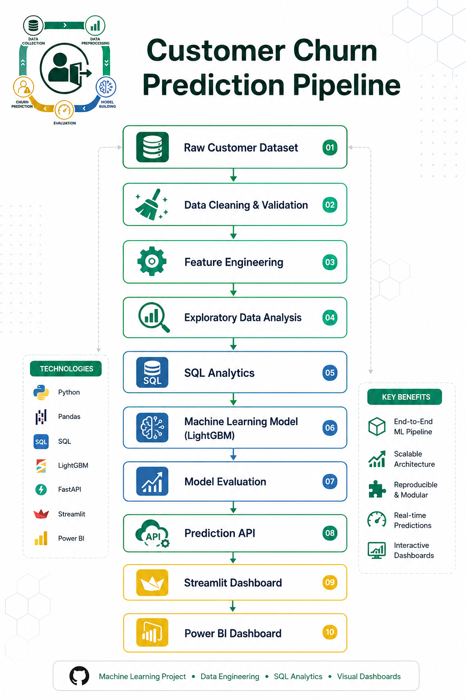
</div>

### Mermaid Architecture Diagram

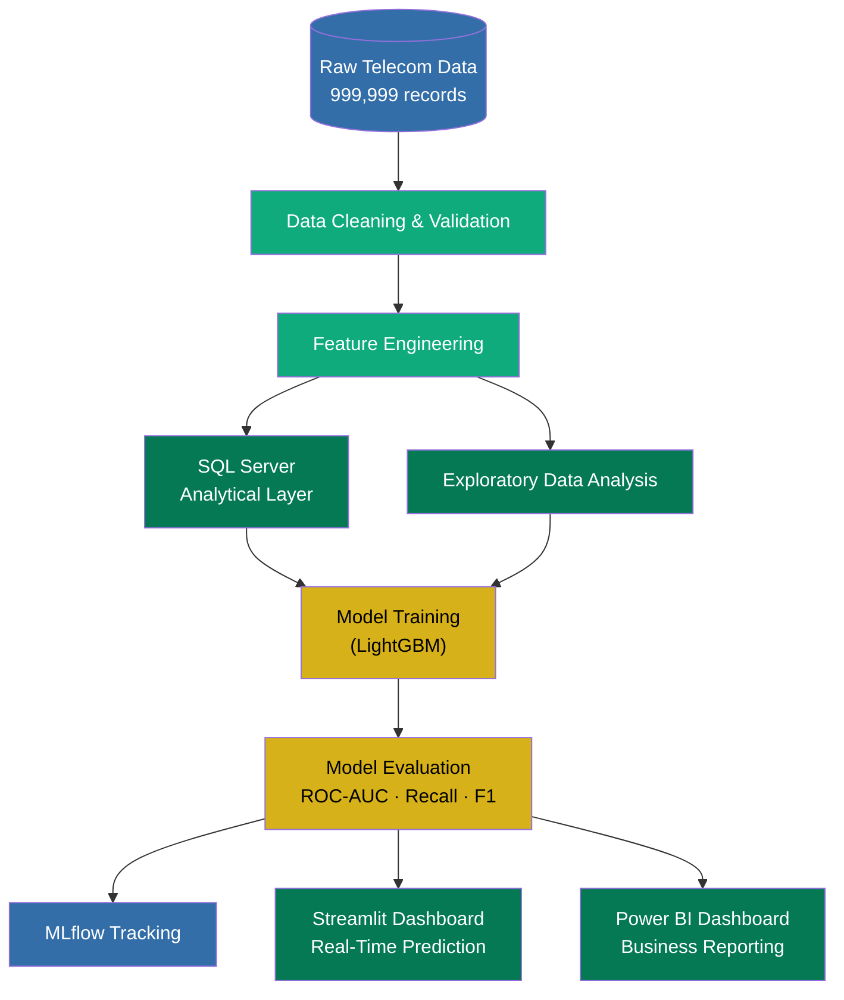

---

## ⚙️ Machine Learning Pipeline

<div align="center">
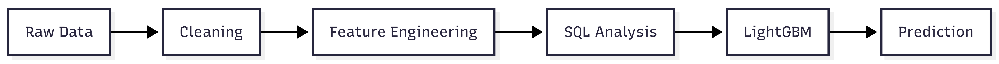
</div>

### Mermaid Pipeline Diagram

```mermaid
flowchart LR
    A["Raw Data"] --> B["Missing Value<br/>Handling"]
    B --> C["Outlier<br/>Treatment"]
    C --> D["Encoding<br/>Categorical Features"]
    D --> E["Feature<br/>Scaling"]
    E --> F["Train/Test<br/>Split"]
    F --> G["Model Training<br/>LightGBM"]
    G --> H["Hyperparameter<br/>Tuning"]
    H --> I["Model<br/>Evaluation"]
    I --> J["Model<br/>Serialization"]
    J --> K["Deployment<br/>Streamlit + Power BI"]

    style A fill:#336EA8,color:#fff
    style G fill:#D7B119,color:#000
    style I fill:#047954,color:#fff
    style K fill:#0FAB7D,color:#fff
```

---

## 📁 Project Structure

```
customer-churn-prediction-pipeline/
│
├── assets/                     # Images, banners, and diagrams used in documentation
│   ├── logo.png
│   ├── banner.png
│   ├── dashboard.gif
│   ├── architecture.png
│   ├── pipeline.png
│   ├── feature_importance.png
│   ├── roc_curve.png
│   ├── confusion_matrix.png
│   ├── sql_analysis.png
│   ├── powerbi_dashboard.png
│   ├── home.png
│   ├── prediction.png
│   └── charts.png
│
|── data/
│   ├── raw/                        # Original dataset (do not modify)
│   │   └── customer_churn.csv
│   └── processed/                  # Cleaned & encoded dataset
│       └── clean_data.csv
│
├── notebooks/
│   ├── 01_data_exploration.ipynb   # Initial data exploration
│   ├── 02_data_preprocessing.ipynb # Cleaning, encoding, scaling
│   ├── 03_model_training.ipynb     # Model building & comparison
│   ├── 04_model_evaluation.ipynb   # Metrics, confusion matrix
│   └── 05_sql_analysis.ipynb       # SQL queries & insights
│
├── database/
│   ├── schema.sql                  # Database schema
│   ├── load_data.py                # Load CSV to SQL Server
│   └── queries/
│       ├── 01_churn_rate.sql
│       ├── 02_churn_by_contract.sql
│       ├── 03_high_risk_customers.sql
│       ├── 04_churn_by_charges.sql
│       └── 05_churn_by_tenure.sql
│
├── models/
│   ├── lgbm_model.pkl              # Trained LightGBM model
│   └── scaler/
│       └── scaler.pk1              # Fitted StandardScaler
│
├── app/
│   └── streamlit_app.py            # Interactive dashboard
│
├── reports/
│   ├── data_engineering_report.pdf
│   ├── data_science_report.pdf
│   ├── eda_report.pdf
│   ├── sql_analysis_report.pdf
│   └── dashboards_report.pdf
│
├── powerbi/                     # Power BI report files
│
│
├── requirements.txt
├── README.md
└── LICENSE
```

---

## 🧹 Data Engineering

The data engineering stage transforms raw, inconsistent telecom records into a clean, model-ready dataset. Key steps include:

- **Missing value imputation** using statistically appropriate strategies per feature type
- **Outlier detection and treatment** on billing and usage variables
- **Categorical encoding** for contract type, payment method, and service plans
- **Feature scaling and normalization** for numerical stability
- **Data validation checks** to guarantee schema and range integrity across all 999,999 rows

---

## 🔍 Exploratory Data Analysis

Extensive EDA was performed to understand churn behavior across demographic, contractual, and usage dimensions — surfacing correlations between tenure, contract type, monthly charges, and churn likelihood that directly informed feature engineering decisions.

<div align="center">
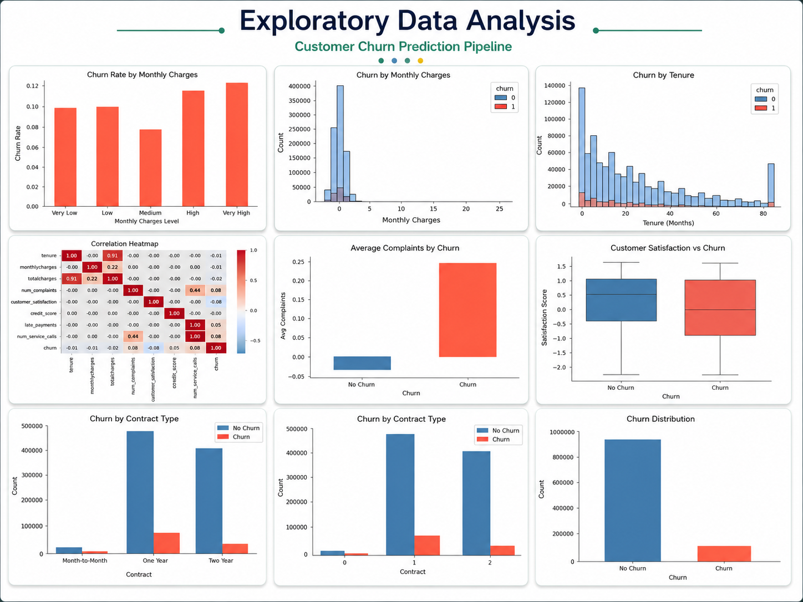
</div>

---

## 🗄 SQL Analysis

A dedicated **SQL Server** analytical layer was built to answer business-facing questions directly against the customer database — churn rate by segment, revenue at risk, and cohort retention trends — complementing the Python-based ML workflow with query-driven reporting.

<div align="center">
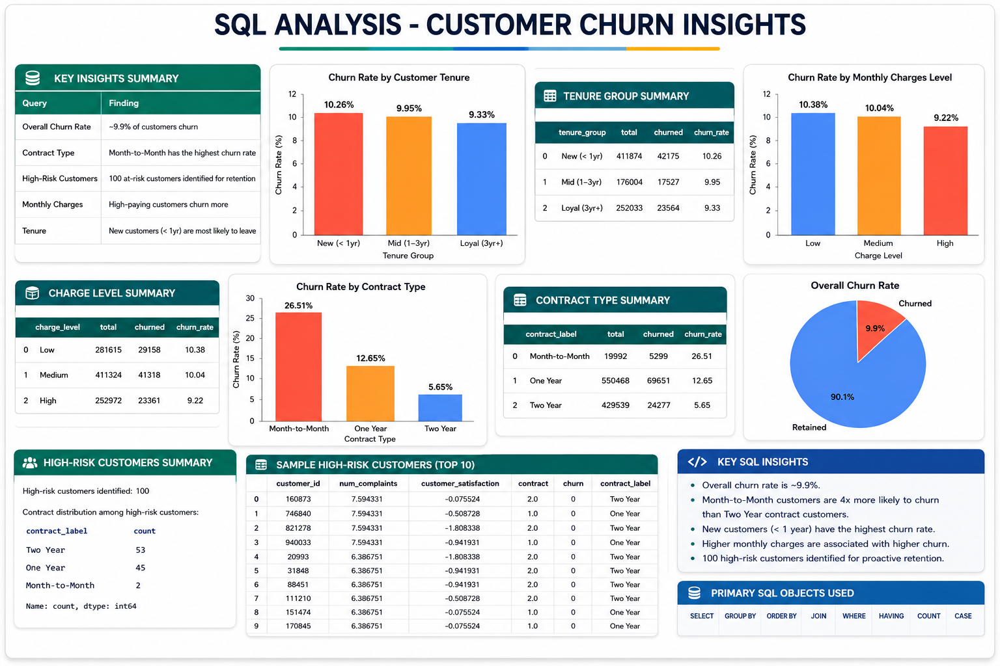
</div>

---

## 🤖 Machine Learning

Multiple candidate algorithms were trained and benchmarked, with **LightGBM** selected as the production model based on its balance of predictive performance and training efficiency on the full 999,999-row dataset.

### Model Comparison

<div align="center">

| Model | ROC-AUC | Recall | F1-Score |
|---|:---:|:---:|:---:|
| Logistic Regression | 0.591 | 0.554 | 0.221 |
| Random Forest | 0.612 | 0.588 | 0.238 |
| **LightGBM (Selected)** | **0.635** | **0.636** | **0.257** |

</div>

> 🏆 **LightGBM** was selected as the final production model, delivering the strongest recall on the churn class — prioritizing the ability to catch at-risk customers.

---

## 📈 Feature Importance

<div align="center">
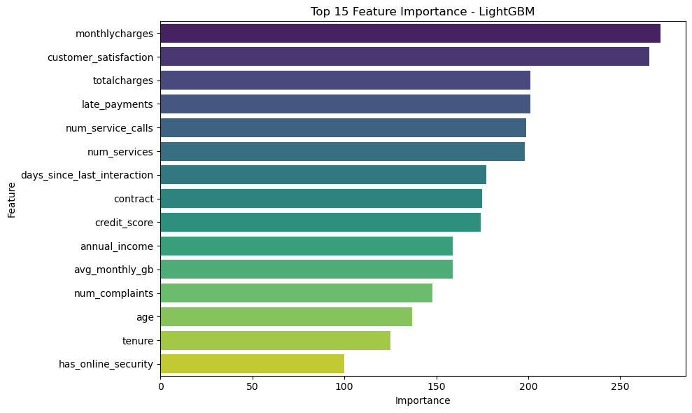
</div>

---

## 📉 ROC Curve

<div align="center">
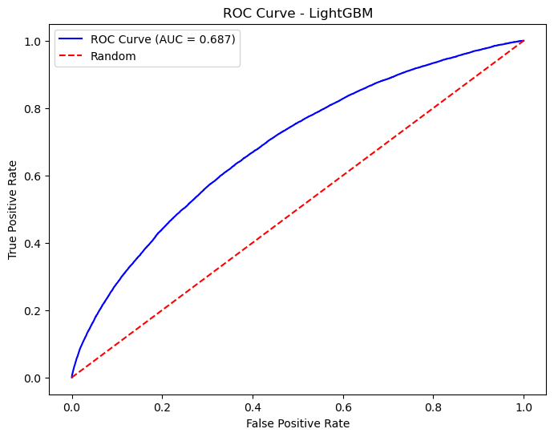
</div>

---

## 🎯 Confusion Matrix

<div align="center">
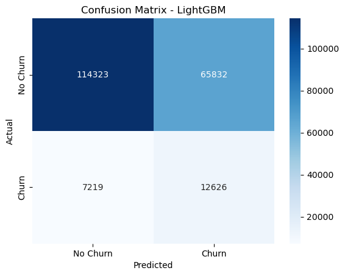
</div>

---

## 🖥 Streamlit Dashboard

An interactive **Streamlit** application allows business users to explore churn drivers and score individual customers in real time.

<div align="center">
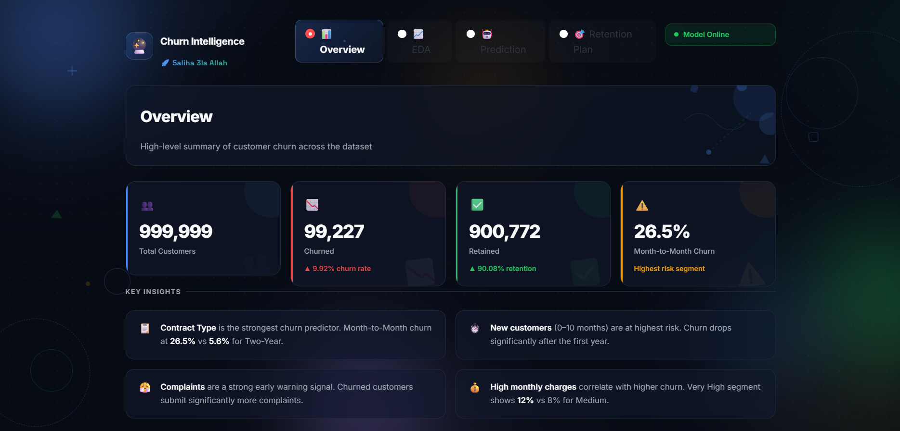
<br/><br/>
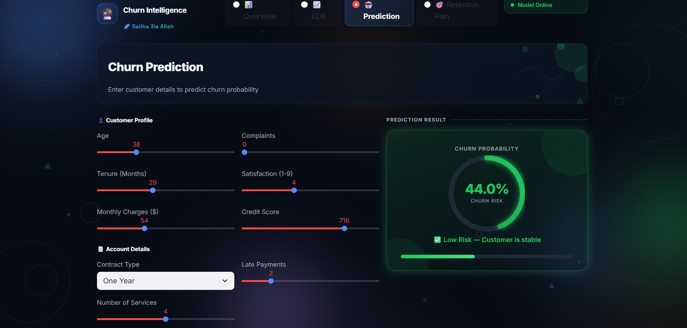
</div>

**🔗 Live App:** [customer-churn-prediction-pipeline.streamlit.app](https://customer-churn-prediction-pipeline.streamlit.app/)

---

## 📊 Power BI Dashboard

A companion **Power BI** report translates model outputs and SQL analytics into an executive-ready dashboard for tracking churn KPIs across the customer base.

<div align="center">
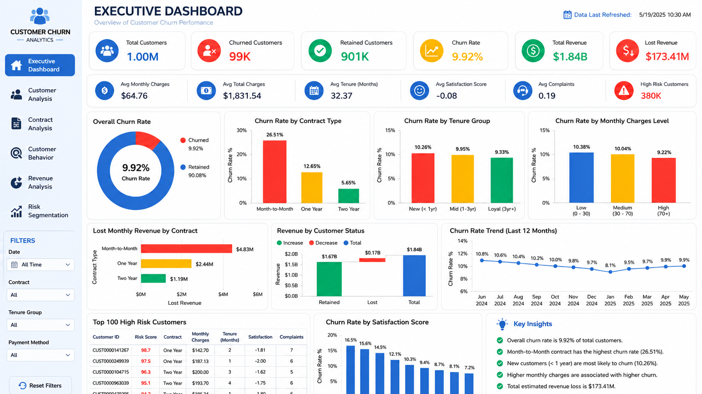
</div>

---

## 🏁 Results

<div align="center">

| Metric | Score |
|---|:---:|
| **ROC-AUC** | 0.635 |
| **Recall** | 0.636 |
| **F1-Score** | 0.257 |
| **Best Model** | LightGBM |
| **Dataset Size** | 999,999 customers |
| **Feature Count** | 32 |

</div>

The final model prioritizes **recall over precision**, reflecting the business reality that the cost of missing a churner (false negative) substantially outweighs the cost of a false alarm (false positive) in a retention-campaign context.

---

## 🛠 Technology Stack

<div align="center">

| Category | Technology |
|---|---|
| **Language** | Python |
| **Data Manipulation** | Pandas, NumPy |
| **Machine Learning** | Scikit-learn, LightGBM |
| **Database** | SQL Server |
| **Web App** | Streamlit |
| **BI & Reporting** | Power BI |
| **Visualization** | Matplotlib |

</div>

<p align="center">
  
</p>

---

## 📦 Installation

```bash
# 1. Clone the repository
git clone https://github.com/your-username/customer-churn-prediction-pipeline.git
cd customer-churn-prediction-pipeline

# 2. Create a virtual environment
python -m venv venv
source venv/bin/activate      # On Windows: venv\Scripts\activate

# 3. Install dependencies
pip install -r requirements.txt

# 4. (Optional) Configure SQL Server connection
# Update your connection string in src/config.py
```

---

## 🚀 How to Run

### 1. Prepare data

```bash
# Run preprocessing notebook
jupyter notebook notebooks/02_data_preprocessing.ipynb
```

### 2. Train model

```bash
# Run training notebook
jupyter notebook notebooks/03_model_training.ipynb
```

### 3. Launch dashboard

```bash
cd D:\project
streamlit run app/streamlit_app.py
```

---

# 🚀 Future Improvements

🐳 **Docker Deployment** — Containerize the entire pipeline to ensure consistent environments, simplify deployment, and improve scalability across different platforms.

📡 **MLflow Tracking** — Integrate MLflow to track experiments, compare model performance, manage model versions, and streamline the machine learning lifecycle.

⚡ **FastAPI REST API** — Expose the trained LightGBM model through a high-performance REST API, enabling seamless integration with external applications and services.

🔄 **Airflow Automation** — Automate the end-to-end workflow, including data ingestion, preprocessing, model retraining, and deployment using Apache Airflow.

☁️ **Azure Cloud Deployment** — Deploy the application and machine learning pipeline on Microsoft Azure to provide scalable, secure, and cloud-native infrastructure.

🚀 **CI/CD Pipeline** — Implement Continuous Integration and Continuous Deployment using GitHub Actions to automate testing, model validation, and application deployment.

---

## 👤 Author

<div align="center">

**Omar**
Machine Learning & Data Engineering

[](https://github.com/)
[](https://customer-churn-prediction-pipeline.streamlit.app/)

</div>

---

## 📄 License

This project is licensed under the **MIT License** — see the [LICENSE](LICENSE) file for details.

---

<div align="center">

### ⭐ If you found this project useful, consider giving it a star!

<a href="#">
  
</a>

<br/><br/>

<sub>Built with 🐍 Python, 💡 LightGBM, and a lot of coffee.</sub>

</div>
